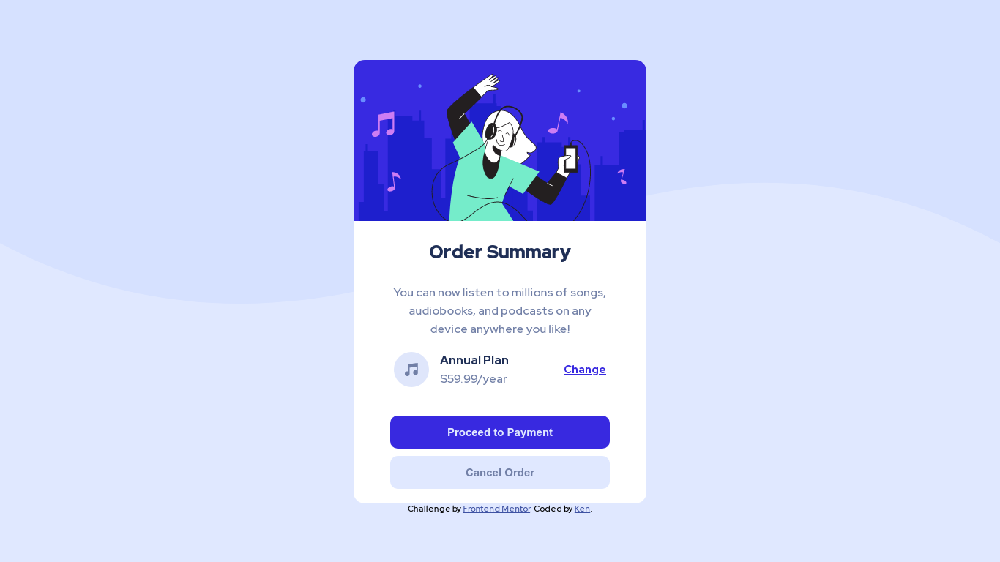
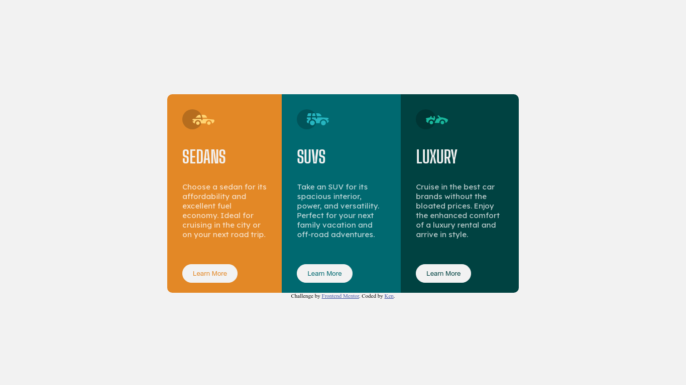
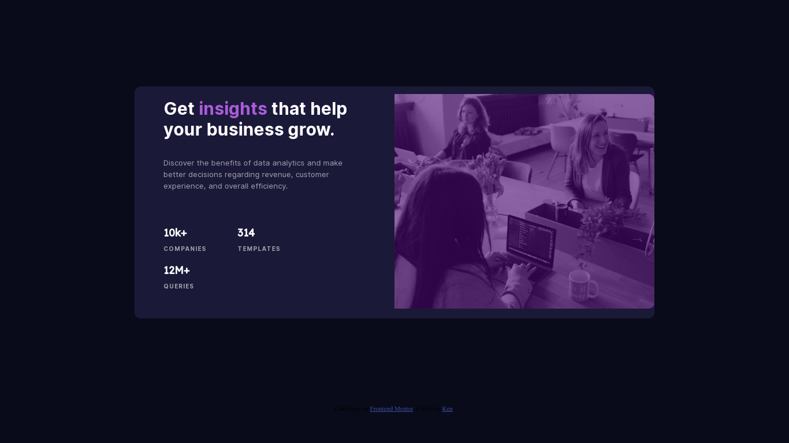
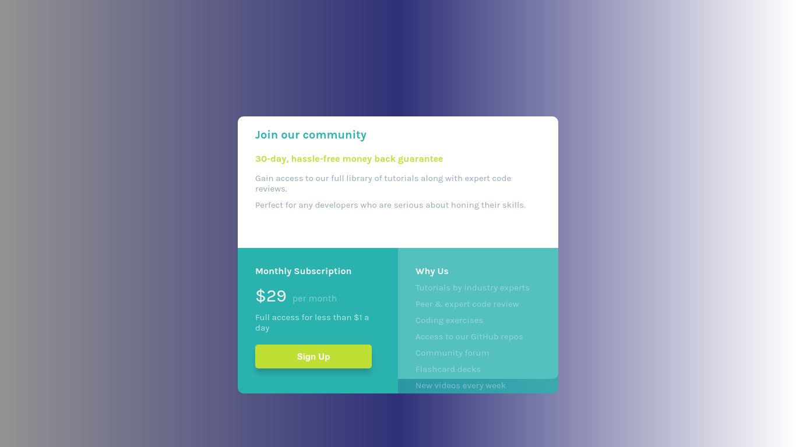

# FrontendMentor-Projects
The projects/challenges I took on Frontend Mentor
# Frontend Mentor Solutions 👨🏻‍💻

I've challenged myself to a **30-DAY-CSS-CHALLENGE,** and what other way than using Frontend Mentor's beautiful designs. I wanted this to be as challenging as it gets, hence I purposely didn't buy the pro version of Frontend Mentor's subscription, so I don't have access to any design files relying only on my vision and approximation.

> Programming is like any other sport. You might know the rules, but you have to play to learn. -- Mark Zuckerberg

| Difficulty | Table of Contents                                                     |
| ---------- | --------------------------------------------------------------------- |
| NEWBIE     | [Order Summary Component](#order-summary-component)                   |
| NEWBIE     | [3 Column Preview Card Component](#column-preview-card-component)     |
| NEWBIE     | [Profile Card Component](#profile-card-component)                     |
| NEWBIE     | [Stats Preview Card Component](#stats-preview-card-component)         |
| NEWBIE     | [Four Card Feature Section](#four-card-feature-section)               |
| NEWBIE     | [Single Price Grid Component](#single-price-grid-component)           |
| NEWBIE     | [Huddle Landing Page](#huddle-landing-page)                           |

## Order Summary Component

- Live Site URL: [https://kens-visuals.github.io/order-summary-component/](https://kens-visuals.github.io/order-summary-component/)
- Repository URL: [https://github.com/kens-visuals/order-summary-component](https://github.com/kens-visuals/order-summary-component)
- Solution URL: [https://www.frontendmentor.io/solutions/basic-card-component-using-sass-preprocessor-and-bem-naming-convention-029xmfY6X](https://www.frontendmentor.io/solutions/basic-card-component-using-sass-preprocessor-and-bem-naming-convention-029xmfY6X)

## 3 Column Preview Card Component

- Live Site URL: [https://kens-visuals.github.io/3-column/](https://kens-visuals.github.io/3-column/)
- Repository URL: [https://github.com/kens-visuals/3-column](https://github.com/kens-visuals/3-column)
- Solution URL: [https://www.frontendmentor.io/solutions/css-custom-properties-css-flexbox-css-grid-xOljzZQUJ](https://www.frontendmentor.io/solutions/css-custom-properties-css-flexbox-css-grid-xOljzZQUJ)

## Profile Card Component

- Live Site URL: [https://kens-visuals.github.io/profile-card-component/](https://kens-visuals.github.io/profile-card-component/)
- Repository URL: [https://github.com/kens-visuals/profile-card-component](https://github.com/kens-visuals/profile-card-component)
- Solution URL: [https://www.frontendmentor.io/solutions/simple-profile-card-component-built-with-scss-HwtVCsqjH](https://www.frontendmentor.io/solutions/simple-profile-card-component-built-with-scss-HwtVCsqjH)

## Stats Preview Card Component

- Live Site URL: [https://kens-visuals.github.io/stats-preview/](https://kens-visuals.github.io/stats-preview/)
- Repository URL: [https://github.com/kens-visuals/stats-preview](https://github.com/kens-visuals/stats-preview)
- Solution URL: [https://www.frontendmentor.io/solutions/stats-card-component-using-bem-and-scss-Xoknc8IAa](https://www.frontendmentor.io/solutions/stats-card-component-using-bem-and-scss-Xoknc8IAa)

## Four Card Feature Section

- Live Site URL: [https://kens-visuals.github.io/four-card-feature-section/](https://kens-visuals.github.io/four-card-feature-section/)
- Repository URL: [https://github.com/kens-visuals/four-card-feature-section](https://github.com/kens-visuals/four-card-feature-section)
- Solution URL: [https://www.frontendmentor.io/solutions/four-card-feature-section-with-bem-and-scss-YfhlZvokE](https://www.frontendmentor.io/solutions/four-card-feature-section-with-bem-and-scss-YfhlZvokE)

## Single Price Grid Component

- Live Site URL: [https://kens-visuals.github.io/single-price-grid-component/](https://kens-visuals.github.io/single-price-grid-component/)
- Repository URL: [https://github.com/kens-visuals/single-price-grid-component](https://github.com/kens-visuals/single-price-grid-component)
- Solution URL: [https://www.frontendmentor.io/solutions/single-price-grid-component-with-no-media-queries-dcVj96LxV](https://www.frontendmentor.io/solutions/single-price-grid-component-with-no-media-queries-dcVj96LxV)

## Huddle Landing Page

- Live Site URL: [https://kens-visuals.github.io/huddle-landing-page/](https://kens-visuals.github.io/huddle-landing-page/)
- Repository URL: [https://github.com/DummyKen/Huddle-landing-page](https://github.com/DummyKen/Huddle-landing-page)
- Solution URL: [https://www.frontendmentor.io/solutions/huddle-landing-page-with-scss-bem-and-css-flexbox-xDNM9FSFX](https://www.frontendmentor.io/solutions/huddle-landing-page-with-scss-bem-and-css-flexbox-xDNM9FSFX)

